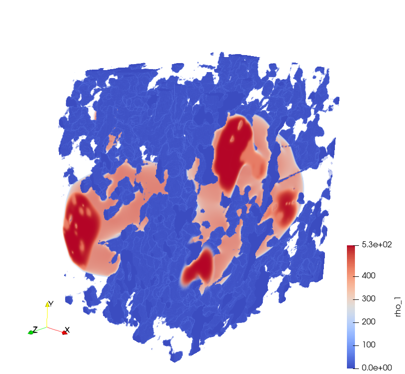
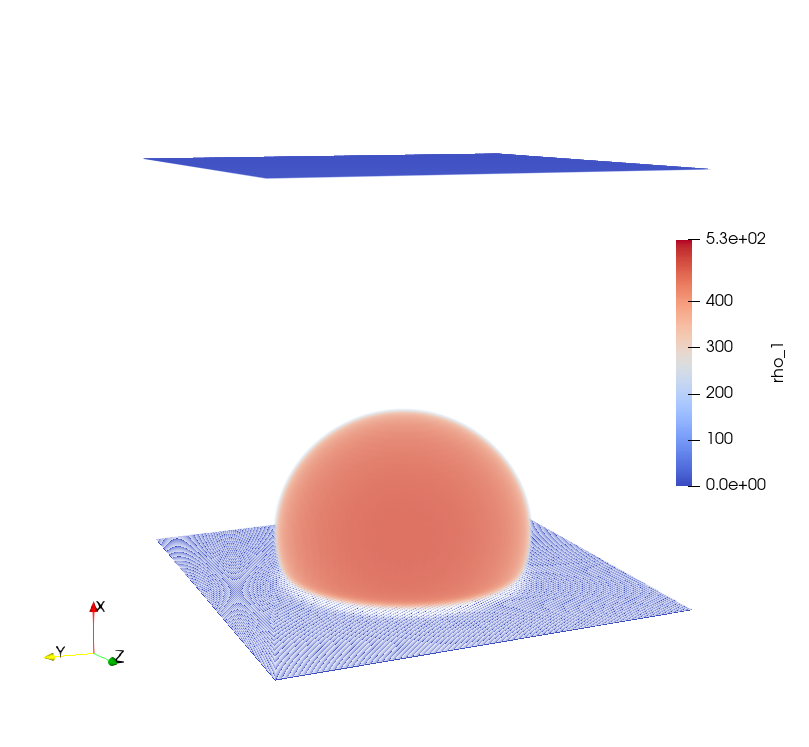
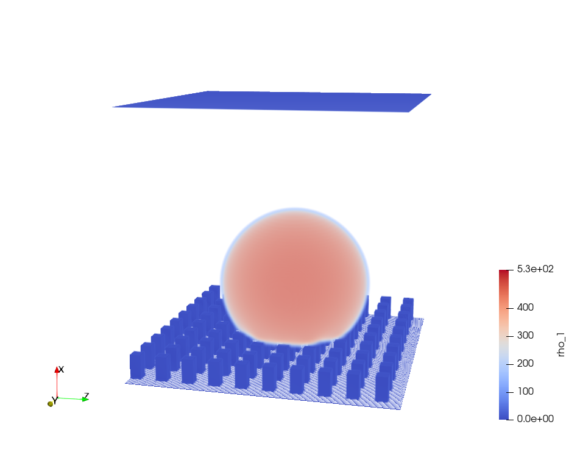

# 3D Multi-phase Lattice Boltzmann Simulations in Hydrophobic Membranes for Membrane Distillation 
  **Tobias Jäger, Athanasios Mokos, Stephan Leyer,  Nikolaos Prasianakis**
 
 *Mechanical Engineering-Heat and Mass Transfer and Thermodynamics, University of Luxembourg
  Transport Mechanisms Group, Laboratory for Waste Management, Paul Scherer Institute, Switzerland*

 <i class="fa fa-at"></i><stephan.leyer@uni.lu>, <nikolaos.prasianakis@psi.ch>
 
 

## Summary

We use the Lattice Boltzmann method to solve multi-phase flow in a nano scale porous medium (membrane). For the full domain up to 650 x 950 x 950 voxels are needed. Leading to a total number of over 0.5 billion voxels with a voxel size of 39 nm.  The domain size is limited by the available amount of device memory. For such a domain size a device memory of about 300 GB is required. For this reason several GPUs in parallel  and a  hybrid CUDA-MPI programming layout are used. Due to the regular geometry of the lattice and the explicit nature of the LB method multithread parallelization within GPUs can be exploited.

 
<figure class="figure" style ="text-align: center">
      
    <figcaption> <em>Figure 1. Water droplet in hydrophobic membrane. A subsection of the full  25.34 x 37.04 x 37.04 μm³ domain is shown.
 </em> </figcaption>
</figure>     
 

## The Problem

Membrane distillation (MD) is a thermally driven separation process below the boiling point. Evaporation and a hydrophobic membrane are used to separate potable water from sea or brackish water. The salt water is in contact with the membrane. The hydrophobisity prevents the salt water from entering the membrane pores. Water molecules evaporate and are transported via diffusion across the hydrophobic membrane to condense on the other side again. Advantage of this technology is that it can be driven by low non concentrated solar energy or waste heat. Compared to other desalination technologies MD has the advantage of small investment and low operating costs. Since the efficiency of MD modules is still comparably low the overall aim is to optimize the membrane and module structure to increase the efficiency.  A common membrane material in MD is Polytetrafluoroethylene (PTFE) with a pore diameter of about 200 - 450 nm. Based on existing 3D membrane geometries  from ptychographic X-ray computed tomography we use the D3Q27 Lattice Boltzman (LB) method to investigate the interaction of the liquid and gaseous phase with the porous membrane material. In particular, the Shan and Chen multi-phase model is used to simulate muti-phase flow at pore level. Nano-scale flow is often difficult to assess experimentally. Knowing more about the interaction between the liquid and the porous membrane could help to increase the efficiency of the MD module. To model a sufficient large fraction (e.g. 25.34 x 37.04 x 37.04 μm³) of the full membrane geometry at pore level up to 650 x 950 x 950 voxels are needed. Leading to a total number of over 0.5 billion voxels with a voxel size of 39 nm.

The Lattice Boltzmann (LB) method is suitable for micro and nano scale structures due to its mesoscopoic description of the fluid. The LB method  is based on kinetic gas theory and the time evolution of the one-body distribution function. Compared to classical CFD the phase space is discretized, ending up in a domain with discrete cells and discrete velocities. After a collision step the discreet  one-body distribution function is streamed to its neighboring cells.

The code is accelerated by using a hybrid CUDA-MPI programming layout which needs to be run on several Nvida GPUs in parallel. Communication between different GPUs is realized with OpenMPI. In the D3Q27 LB method the evolution of a 27 distribution function has to be calculated at each lattice node. This evolution includes three major steps; namely collision, streaming and force calculation. All steps have no time-implicit dependence on neighboring nodes, a property which renders the method explicit and hence fully local. Such a local algorithm further eliminates the need for an expensive solution of a linear system of equations while allowing for a multithread parallelization within GPU. The force calculation only depends on the states of its 26 direct neighbors. During the streaming step the 27 distribution functions of each node are move to its respective neighboring node. For these two steps communication with the neighboring nodes takes place. The domain size is limited by the available amount of device memory. For a domain size of  650 x 950 x 950 voxels a device memory of about 300 GB is required. For this reason several GPUs in parallel are needed.

The developed multi-phase LB code is based on a single-phase multi GPU LB code provided by Paul Scherer Institute (Switzerland). For the single-phase multi GPU LB code the best LB solver performance (compromise of the computational costs and efficiency) was found for the case where a minimal number of GPUs was used. This means the device memory of one GPU is nearly completely filled. Since the structure of the multi-phase code is very similar to the original single-phase code a similar performance is expected.

The 3D data, represented on a Cartesian grid, are decomposed in domains along one (longest) dimension ensuring necessary RAM and FLOP balance between nodes. The computational algorithm requires exchange of data located at domain interfaces at each force calculation and streaming step. This exchange of interfacial data is implemented using OpenMPI.

## Results

Nano-scale flow is often difficult to assess in the laboratory, little is known about the interaction of liquid, gas and hydrophobic membrane material at pore level. To increase the efficiency of MD modules a better understanding of the evaporation at pore level would be beneficial. The surface area of the liquid-vapor interface and the diffusive transport through the membrane play an important role. Larger surface areas of the liquid-vapor interface will lead to a higher evaporation fluxes. The diffusive transport comes indirectly into play since it will influence the vapor pressure at the interface and therefore the evaporation flux. Therefore we aim to investigate the liquid, vapor and membrane interaction by exploiting a multi phase Lattice Boltzmann (LB) method.

 
<figure class="figure" style ="text-align: center">
      
    <figcaption> <em>Figure 2.  Droplet on a flat hydrophobic surface. Periodic boundary conditions in y and z direction. Contact angle changes depending on the hydrophobicity. 
 </em> </figcaption>
</figure>     
 

 
<figure class="figure" style ="text-align: center">
      
    <figcaption> <em>Figure 3. Droplet on a rough hydrophobic surface. Periodic boundary conditions in y and z direction. The roughness of the surface has also an impact on the contact angle.

 </em> </figcaption>
</figure>     
 

## References
[^1]: Kerstin Cramer et al. “Three-Dimensional Membrane Imaging with X-ray Ptychography: Determination of Membrane Transport Properties for Membrane Distillation”. In: Transport in Porous Media (2021).

[^2]: Abdullah Alkhudhiri, Naif Darwish, and Nidal Hilal. “Membrane distillation: A comprehensive review”. In: Desalination 287 (2012).

[^3]: Chi Peng et al. “Single-component multiphase lattice Boltzmann simulation of free bubble and crevice heterogeneous cavitation nucleation”. In: Physical review. E 98.2-1 (2018).

[^4]: Mohammad Amin Safi et al. A pore-level direct numerical investigation of water evaporation characteristics under air and hydrogen in the gas diffusion layers of polymer electrolyte fuel cells”. In: International Journal of Heat and Mass Transfer

[^5]: X Shan and H Chen. “Simulation of nonideal gases and liquid-gas phase transitions by the lattice Boltzmann equation”. In: Physical Review. E, Statistical Physics, Plasmas, Fluids, and Related Interdisciplinary Topics; (United States) (Apr. 1994).

[^6]: Xiaowen Shan and Hudong Chen. “Lattice Boltzmann model for simulating flows with multiple phases and components”. In: Phys. Rev. E 47 (3 1993).

[^7]: N. I. Prasianakis et al. “Lattice Boltzmann method with restored Galilean invariance”. In: Computational methods in fluid dynamics, Kinetic theory (June 2009).

[^8]: Aaron H. Persad and Charles A. Ward. “Expressions for the Evaporation and Condensation Coefficients in the Hertz-Knudsen Relation”. In: Chemical Reviews 116.14 (2016).