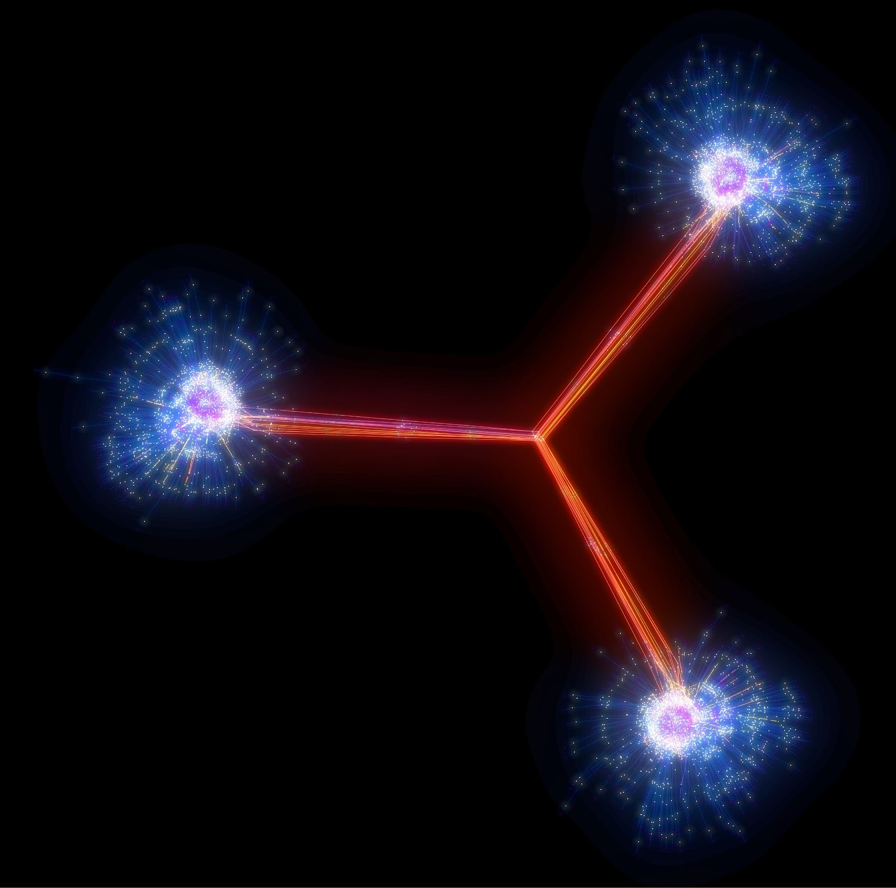
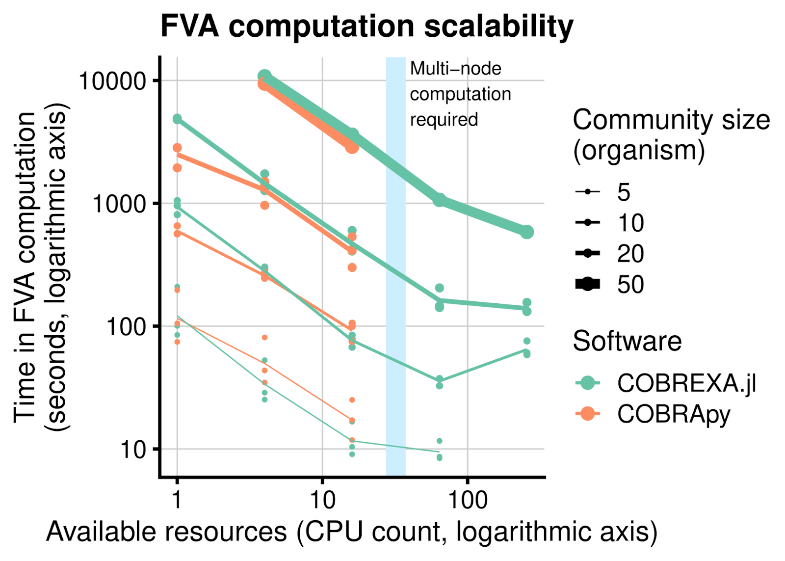

# COBREXA.jl -- Large-scale constraint-based metabolic modeling

  <strong>Miroslav Kratochvíl, Laurent Heirendt, Christophe Trefois, Wei Gu, St. Elmo Wilken (HHU.de), Taneli Pusa, Alberto Noronha (Nium.io)</strong> 
 
 *Biocore,
  Luxembourg Centre for Systems Biomedicine (LCSB), 
  University of Luxembourg*

 <i class="fa fa-at"></i> <reinhard.schneider@uni.lu>,
 <i class="fab fa-internet-explorer"></i> <a href="url">https://lcsb-biocore.github.io/COBREXA.jl</a>
 
 

## Summary

COBREXA.jl is a software package intended  for working with large constraint-based metabolic models, and running very large numbers of analysis tasks on these models in parallel. Its main purpose is to make the methods of Constraint-based Reconstruction and Analysis (COBRA) scale to problem sizes that require the use of huge compute clusters and HPC environments, which allows them to be realistically applied to pre-exascale-sized models.
For the users of the COBRA methodology, COBREXA.jl provides a transparent way to scale up their analysis to utilize the power of HPC. At the same time, the package is written in a high-performance programming environment (Julia) that facilitates efficiency of any user-implemented extensions and customizations.

 
 

<figure class="figure" style ="text-align: center">
    
    <figcaption> <em>A simplified graph view of a metabolic model of a small community of 3 differently deficient mutant species of Escherichia coli exchanging the metabolites required for growth; dots represent individual metabolites and reactions. COBREXA.jl provides a way to easily inspect the properties and limits of each reaction en masse, quickly providing comprehensive predictions about realistic model behavior. </em> </figcaption>
</figure>

 
 

## The Problem

While the core mathematical problem behind the COBRA methodology – solution of constrained optimization problems – does not generally admit parallelizable algorithms that could be accelerated for HPC, most metabolic analyses consist of solving ensembles of the models. COBREXA.jl facilitates the organization of the parallel solving of the ensembles of problems by minimizing the amount of code required to implement the analysis, and optimizing several factors that affect performance, mainly data transfers and task schedules.
Typically, the computational complexity of the analysis is derived from the complexity of the underlying model, amount of modifications that need to be performed on the model, and the total count of small analysis “subtasks”. The solution of each subtask typically comprises one customization of a base model (such as simulating a knock-out of several genes) and one run of the optimization solver. The runtime of the subtask is most often linked to the performance of the optimization solver, which is highly data-dependent and related to the number of biochemical reactions. The reaction count in the single model typically ranges between 1 thousand and 1 million, while the number of the model variants in the usual ensembles solved in parallel easily reaches millions or billions. 

## Results

At UL, we have used COBREXA.jl to simulate large bacterial community models that contain millions of individual chemical reactions, solving thousands of analysis tasks in parallel. This allowed us to easily reach results about variability and statistical properties of the metabolic flux in the bacterial communities. Benchmarks have shown that the speed-up provided by COBREXA.jl scales well to larger problem sizes and additional hardware resources. This provides a clear advantage over other COBRA implementations by transparently spreading the computation over multiple computation nodes.

 

<figure class="figure" style ="text-align: center">
    
    <figcaption> <em>Illustrative benchmark of COBREXA.jl performance compared on running a Flux Variability Analysis (FVA) with another COBRA implementation. Although it is theoretically possible to make any COBRA software packages scale to multiple computing nodes, it comes with a large implementation overhead for the users, who would need to re-create the optimizations and task distribution routines already implemented in COBREXA.jl.</em> </figcaption>
</figure>

 

## References

[^1]: Kratochvíl M, Heirendt L, Wilken SE, Pusa T, Arreckx S, Noronha A, van Aalst M, Satagopam VP, Ebenhöh O, Schneider R, Trefois C., Gu W. COBREXA. jl: constraint-based reconstruction and exascale analysis. Bioinformatics. 2022 Feb 15;38(4):1171-2.

