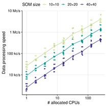

# GigaSOM.jl -- Huge-scale cytometry clustering and visualization

  <strong>Christophe Trefois, Laurent Heirendt, Miroslav Kratochvil and Oliver Hunewald(LIH)</strong> 
 
 *Biocore,
  Luxembourg Centre for Systems Biomedicine (LCSB), 
  University of Luxembourg*

 <i class="fa fa-at"></i> <reinhard.schneider@uni.lu>,
 <i class="fab fa-internet-explorer"></i> <a href="url">https://github.com/LCSB-BioCore/GigaSOM.jl </a>
 
 

## Summary

GigaSOM.jl is a Julia toolkit for clustering and visualisation of extremely large datasets from cytometry experiments. Most generally, it can load FCS files, perform transformation and cleaning operations in their contents, run FlowSOM-style clustering, and visualize and export the results. GigaSOM is distributed and parallel in nature, which makes processing huge datasets a breeze -- a hundred of millions of cells with a few dozen parameters can be accurately clustered and visualized in a few minutes.
GigaSOM.jl was developed in cooperation with Luxembourg Institute of Health to address the needs of the researchers in immunology; but the application spans multiple areas of cell and molecular biology, oncology, and even plants and marine ecosystem biology.
Figure 1 clearly shows large clusters that contain distinct immune cell populations. Individual data points are colored by surface protein expression (green: CD4, red: CD8, blue: CD161). The underlying model provides enough detail to characterize even small and rare cell subsets. (Data was generated by the international Mouse Phenotyping Consortium; dataset available at [http://flowrepository.org/id/FR-FCM-ZYX9](http://flowrepository.org/id/FR-FCM-ZYX9))

 
 

<figure class="figure" style ="text-align: center">
    
    <figcaption> <em>Figure 1. Visualization of the dimensionality-reduced distribution of more than 1.1B single-cell measurement events produced with GigaSOM.jl. </em> </figcaption>
</figure>

 
 

## The Problem

The GigaSOM.jl package is a flexible, horizontally scalable, HPC-aware version of the batch SOM training. The language choice has allowed a reasonably high-level description of the problem suitable for easy customization, while still supporting the efficient low-level operations necessary for fast data processing. GigaSOM.jl contains a library of functions for loading the data from Flow Cytometry Standard (FCS) files, distributing the data across a network to remote computation nodes present in the cluster, running the parallelized computation as well as exporting and visualizing the results.
The distributed computation process in GigaSOM is structured such that each computation node (“worker”) operates on  its own persistent slice of the whole dataset, and the partial results from each node are aggregated by the master node. To establish this structure, GigaSOM implements a separate procedure that aggregates the input FCS files and creates a balanced set of slices equally distributed among the workers. Each computation node interprets its assigned slice description and extracts the part of the data from the relevant FCS files saved on a shared storage. Importantly, the shared filesystem is usually one of the most efficient ways to perform data transfers in HPC environments, which makes the dataset loading process very fast. If a shared filesystem is not available, GigaSOM.jl also includes optional support for direct data distribution using the Distributed.jl package.
The GigaSOM.jl implementation of the batch SOM algorithm is composed of distributed computations that are expressed as a series of MapReduce-style operations, which are implemented as high-order functions. This has allowed us to clearly separate the low-level code required to support the parallel processing from the actual implementation of the algorithm, thus improving the code maintainability and vastly simplifying further custom, user-specifiable data manipulation in the distributed environment. The abstraction additionally enables future transition to more complex data-handling routines or different parallelization systems. GigaSOM.jl can be transparently modified to support distributed parallel broadcast and reduction that might be required for handling huge SOMs on a very large number of workers, or even run on a different distributed framework, such as MPI.

## Results
The main result achieved by GigaSOM (see Figure 2.) is the ability to quickly cluster and visualize datasets of previously unreachable size. In particular, we show that the construction of a SOM from $10^9$ cells with 39 parameters can be performed in minutes, even on relatively small computer clusters with less than hundreds of CPU cores. The SOM can be used to quickly dissect and analyze the samples, as with FlowSOM. This performance achievement vastly simplifies the interactive work with large datasets because the scientists can, for instance, try more combinations of hyperparameters and quickly get the feedback to improve the analysis and clustering of the data.
Most importantly, the speed of the processing allows the scientists to work with much higher clustering resolution than available in current software packages, thus increasing the capability of the analysis to capture and describe various small effects in the cell distributions, and rare cell populations.
The ability to process a gigascale dataset to a comprehensible embedding and precise, easily scrutinizable statistics in mere minutes may play a crucial role in both design and analysis methods of future cytometry experiments. We believe that the accessible and flexible nature of the GigaSOM.jl implementation in the Julia programming language will also drive a transformation of other tools in the ecosystem towards the support of big data processing paradigms.

 

<figure class="figure">
    
    <figcaption> <em>Figure 2. Performance of GigaSOM. </em> </figcaption>
</figure>

 

## References

[^1]: Kratochvíl, Miroslav, Oliver Hunewald, Laurent Heirendt, Vasco Verissimo, Jiří Vondrášek, Venkata P. Satagopam, Reinhard Schneider, Christophe Trefois, and Markus Ollert. "GigaSOM. jl: High-performance clustering and visualization of huge cytometry datasets." GigaScience 9, no. 11 (2020): giaa127.

