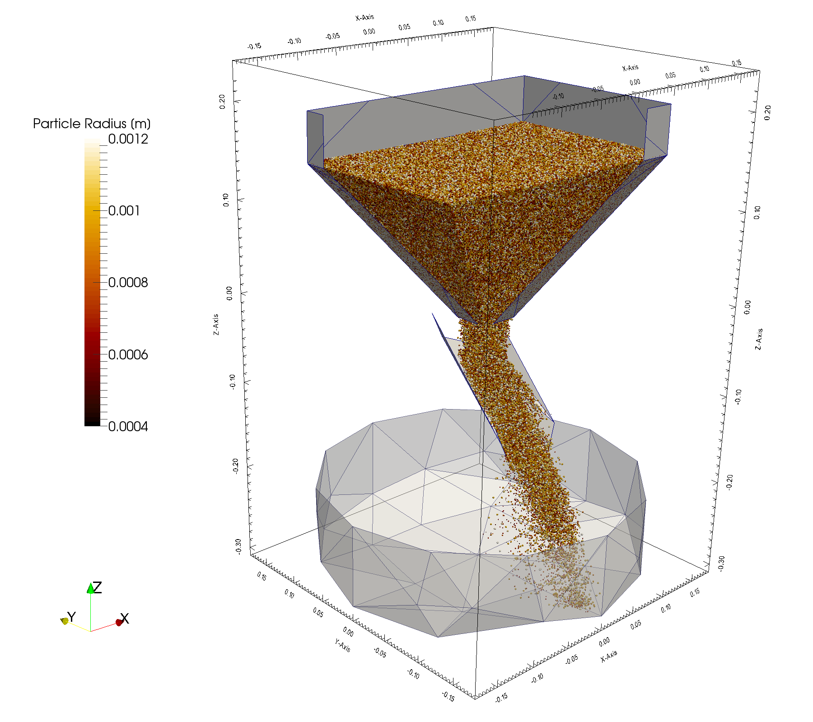
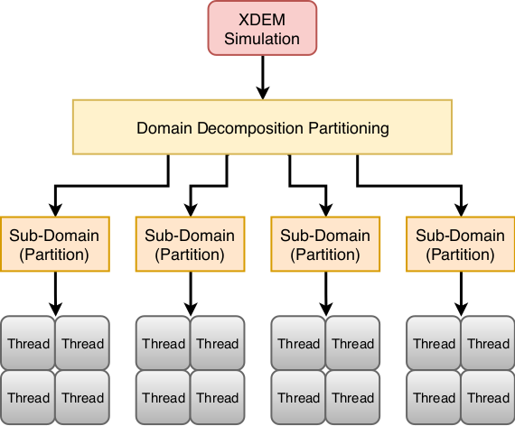
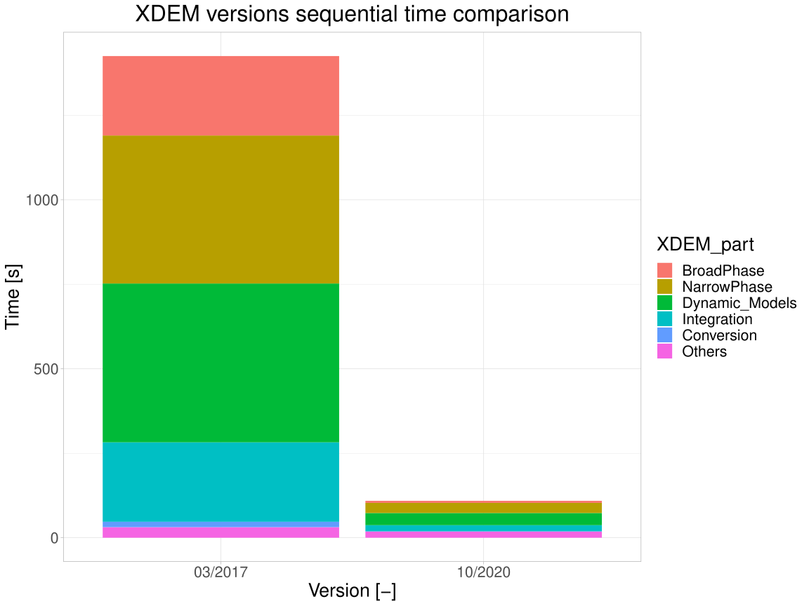
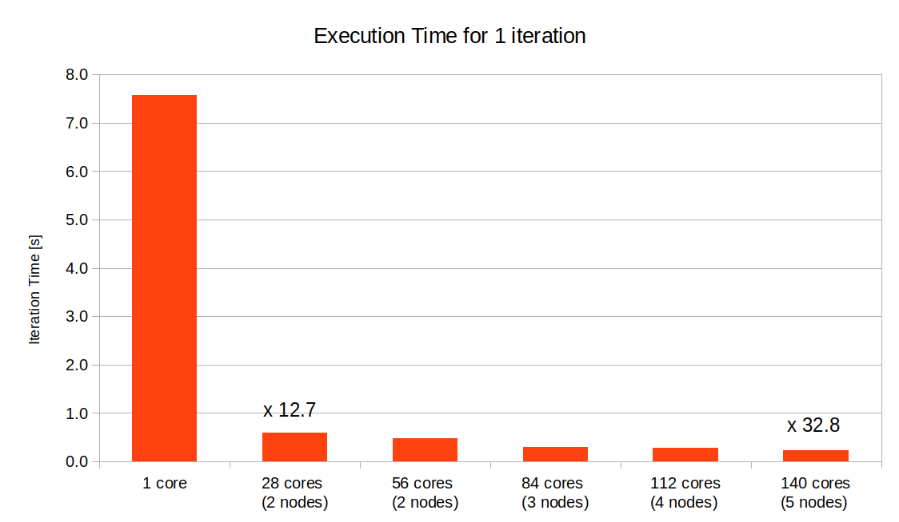

# Hybrid MPI+OpenMP Parallelization for Discrete Element Method

   **Prof. Bernhard Peters, Dr. Xavier Besseron, Dr. Alban Rousset, Dr. Abdoul Wahid Mainassara Chekaraou **  
 
 *LuXDEM Research Centre,
  Department of Engineering, 
  University of Luxembourg*

   
 <i class="fa fa-at"></i><bernhard.peters@uni.lu>, <xavier.besseron@uni.lu>
 <i class="fab fa-internet-explorer"></i><a href="url">http://luxdem.uni.lu/ </a>
 
 

## Summary

The Extended Discrete Element Method (XDEM) is a novel and innovative numerical simulation technique that extends classical Discrete Element Method (DEM) (which simulates the motion of granular material), by additional properties such as the chemical composition, thermodynamic state, stress/strain for each particle. It has been applied successfully to the processing of granular materials such as sand, rock, wood or coke and is used in numerous industrial processes like iron oxides reduction in blast furnaces, wood drying, pyrolysis and combustion for biomass conversion or transport of bulk material by conveyor belts [^1].

In this context, computational simulation with (X)DEM has become a more and more essential tool for researchers and scientific engineers to set up and explore their experimental processes. However, increasing the size or the accuracy of a model requires the use of High Performance Computing (HPC) platforms over a parallelized implementation to accommodate the growing needs in terms of memory and computation time. In practice, such a parallelization is traditionally obtained using either MPI (distributed memory computing), OpenMP (shared memory computing) or hybrid approaches combining both of them.

Thanks to optimization and parallelization of XDEM implemented in the last year, it can now simulate complex and real-life cases using a large number of particles and interactions. For example, the charging of 1 million particles in a hopper using a rotating chute requires about 15 days of simulation using 5 computing nodes. The same simulation running in sequential without parallelization and HPC would run for one year and a half!

 
<figure class="figure" style ="text-align: center">
      
    <figcaption> <em>Figure 1. Discharge of a hopper using a rotating chute. Thanks to parallelization and execution on the Uni.lu HPC platform, millions of particles can be simulated in order to study the segregation of the minerals with different sizes.
 </em> </figcaption>
</figure>     
 

<video width="640" height="480" class="embed-responsive embed-responsive-16by9" loop
controls muted>
<source src="videos/BlastFurnaceCharging-output.mp4"
type='video/mp4' />
</video>

## The Problem

XDEM is computation intensive on many aspects: collision detection between complex shapes over a large number of objects is computation-expensive and requires a small integration time-step of the motion prediction. Each individual particle uses an internal discretization to represent its thermodynamic state and chemical composition and requires an equation system to be built and solved for each particle at every time-step. To provide significant results, industrial processes must be simulated with hundreds of thousands or even millions of particles over a long period of time, thousands of seconds or more. For this reason, DEM in general, and XDEM in particular, are affected by two major issues: a huge computation time and large memory usage, which can be solved using High Performance Computing.
In the last years, a considerable amount of work has been invested in the XDEM software to address these issues and allow it to leverage the full power of HPC platforms. This work covers various aspect:

* Coarse grain parallelization using MPI for distributed memory execution to take advantage of the memory and CPUs of multiple computing nodes [^2],
* Partitioning and dynamic load-balancing [^7],
* Fine grain parallelization using OpenMP for shared memory execution to provide faster computation within a single computing node [^3],
* Hybrid MPI+OpenMP execution which alleviates the pressure on the load-balancing algorithm at large scale [^3],
* New algorithms for the broad-phase collision detection and sequential code optimizations [^3] [^4] [^5] [^6].

 
<figure class="figure" style ="text-align: center">
    
    <figcaption> <em>Figure 2. Two-level hybrid execution of XDEM on an HPC cluster: First, the simulation domain is decomposed using a partitioning algorithm to balance the load between computing nodes. Communication between subdomains is performed using MPI. Secondly, calculation within a computing node is executed using OpenMP to benefit from fast data access via shared memory. </em> </figcaption>
</figure>     
 
 

## Results

Individually, each piece of work has its own benefit for the XDEM software, and put all together it allows to run complex simulations that were inconceivable a few years ago.

 
<figure class="figure" style ="text-align: center">
    
    <figcaption> <em>Figure 3. Between March 2017 and October 2020, the new algorithms and sequential code optimization within XDEM made the code 13 times faster.</em> </figcaption>
</figure>     
 

Considering first the sequential execution, the execution speed of XDEM has been improved by a factor of 13 in the last 4 years. This is due to multiple improvements in the code, principally: optimization of the collision detections, a new Verlet buffer approach and a change of the data structure for better memory accesses. The improvement on the sequential execution also benefits parallel executions.

 
<figure class="figure" style ="text-align: center">
    
    <figcaption> <em>Figure 4. Average execution time of one iteration for the Charging of the Hopper with 1 million particles. Execution on one single node, using 2 MPI processes with 14 threads each, the execution is 12.7 times faster than in sequential. Using 5 nodes, the execution is 32.8 times faster.</em> </figcaption>
</figure>     
 

The performance of the parallel execution was evaluated on the charging of a hopper with 1 million particles. For this case, the new version of the code  offers a 32.8 speedup when running on 5 computing nodes on hybrid mode with 2 MPI processes per node and 14 OpenMP threads per process. Those results are highly dependent on the test case being considered, and usually cases with more particles show a better speedup.
With this configuration, the simulation of the settlement of 1 million particles over 10 seconds requires about 380 hours of computation time on 5 nodes, more than 15 days. In sequential, this same simulation is estimated to run for one year and half. 

## References

[^1]:Peters, B., Baniasadi, M., Baniasadi, M., Besseron, X., Estupinan Donoso, A. A., Mohseni, S., & Pozzetti, G. (2019). The XDEM Multi-physics and Multi-scale Simulation Technology: Review on DEM-CFD Coupling, Methodology and Engineering Applications. Particuology, 44, 176 - 193. http://hdl.handle.net/10993/36884

[^2]: Besseron, X., Hoffmann, F., Michael, M., & Peters, B. (2013). Unified Design for Parallel Execution of Coupled Simulations using the Discrete Particle Method. Proceedings of the Third International Conference on Parallel, Distributed, Grid and Cloud Computing for Engineering. Stirlingshire, United Kingdom: Civil-Comp Press. http://hdl.handle.net/10993/1427

[^3]: Mainassara Chekaraou, A. W., Rousset, A., Besseron, X., Varrette, S., & Peters, B. (2018). Hybrid MPI+OpenMP Implementation of eXtended Discrete Element Method. Proc. of the 9th Workshop on Applications for Multi-Core Architectures (WAMCA'18), part of 30th Intl. Symp. on Computer Architecture and High Performance Computing (SBAC-PAD 2018). Lyon, France: IEEE Computer Society. http://hdl.handle.net/10993/36374

[^4]: Mainassara Chekaraou, A. W., Besseron, X., Rousset, A., & Peters, B. (2020). Local Verlet buffer approach for broad-phase interaction detection in Discrete Element Method. Submitted to the journal of Advances in Engineering Software

[^5]: Mainassara Chekaraou, A. W., Besseron, X., Rousset, A., Kieffer, E., & Peters, B. (2020). Predicting near-optimal skin distance in Verlet buffer approach for Discrete Element Method. 10th IEEE Workshop on Parallel / Distributed Combinatorics and Optimization. http://hdl.handle.net/10993/44814

[^6]: Rousset, A., Mainassara Chekaraou, A. W., Liao, Y.-C., Besseron, X., Varrette, S., & Peters, B. (2017). Comparing Broad-Phase Interaction Detection Algorithms for Multiphysics DEM Applications. AIP Conference Proceedings ICNAAM 2017. New York, NY: American Institute of Physics. http://hdl.handle.net/10993/32261

[^7]: Besseron, X., Rousset, A., Mainassara Chekaraou, A. W., & Peters, B. (2021). Partitioning and load balancing policies for eXtended Discrete Element Method. In preparation