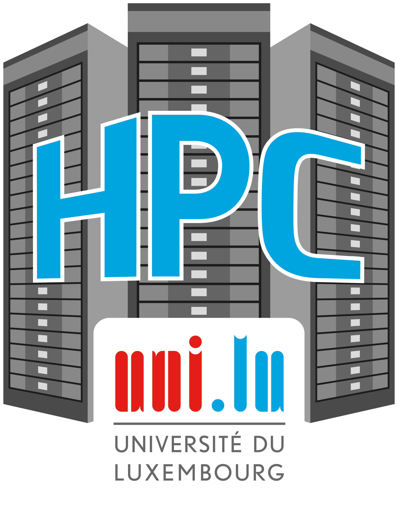

[{: style="width:140px; float: right;"}](https://hpc.uni.lu)

# Uni.lu HPC Demonstrators
Selected applications and demonstrators established using the [High Performance Computing (HPC)](https://hpc.uni.lu) resources of the University of Luxembourg.

## List of Demonstrators

| Title                                                                                                                          |
|--------------------------------------------------------------------------------------------------------------------------------|
| __[Digital Twin of a Biomass Furnace](biomass/index.md)__                                                                      |
| __[Co-located Partitioning for Multi-Physics Coupled Simulations](ColocatedMultiPhysics/index.md)__                            |
| __[Hybrid MPI+OpenMP Parallelization for Discrete Element Method](hybridDEM/index.md)__                                        |
| __[Transition to Green Hydrogen in Steel Making](steelmaking/index.md)__                                                       |
| __[Toward exact interaction energies in large molecules with Quantum Monte Carlo](quantumMC/index.md)__                        |
| __[Parameter Calibration for Multi-Physics Simulations](parametercalib/index.md)__                                             |
| __[3D Multi-phase Lattice Boltzmann Simulations in Hydrophobic Membranes for Membrane Distillation](BoltzmannSim/index.md)__   |

Consider our latest **[ULHPC User Guide (PDF)](https://hpc.uni.lu/download/slides/2020-ULHPC-user-guide.pdf)**

* [What is [UL]HPC](https://hpc-docs.uni.lu/getting-started/#what-is-ulhpc) -- [Supercomputing and Storage Resources at a glance](https://hpc-docs.uni.lu/getting-started/#supercomputing-and-storage-resources-at-a-glance)
* [Getting Started](https://hpc-docs.uni.lu/getting-started/)
* [ULHPC Software/Modules Environment](https://hpc-docs.uni.lu/environment/modules/)
* [ULHPC Usage Charging Policy](https://hpc-docs.uni.lu/policies/usage-charging/)

[:fontawesome-solid-rocket: Aion](https://hpc-docs.uni.lu/systems/aion){: .md-button .md-button--link }
[:fontawesome-solid-sign-in-alt: Technical Docs](https://hpc-docs.uni.lu/){: .md-button .md-button--link }
[:fontawesome-solid-sign-in-alt: Tutorials](https://ulhpc-tutorials.readthedocs.io){: .md-button .md-button--link }
[:fontawesome-solid-rocket: Iris](https://hpc-docs.uni.lu/systems/iris){: .md-button .md-button--link }

  