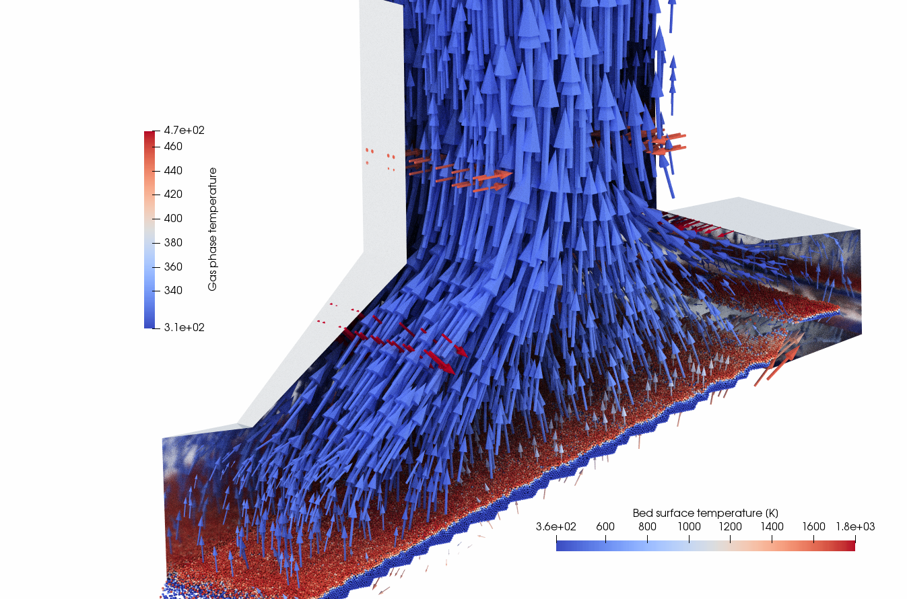
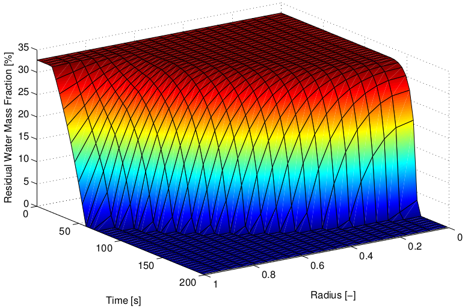
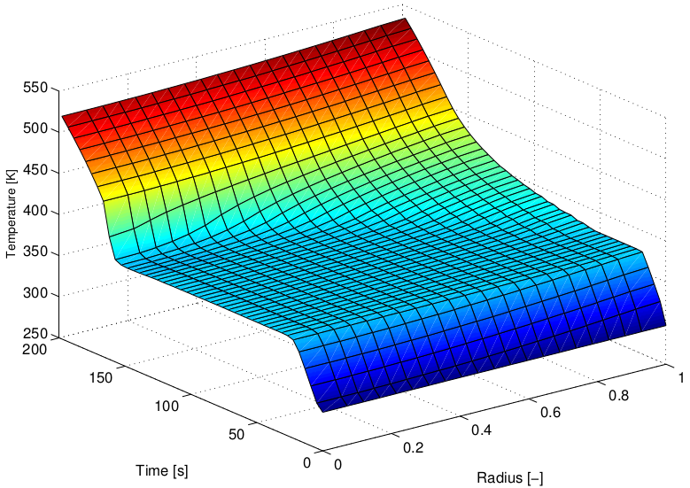
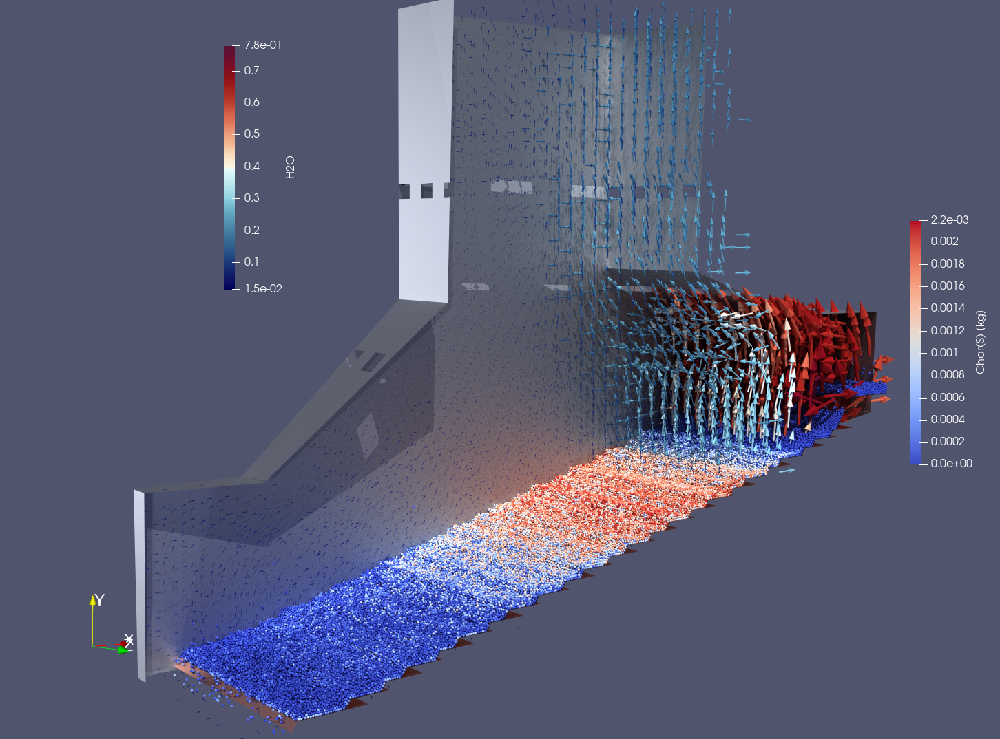
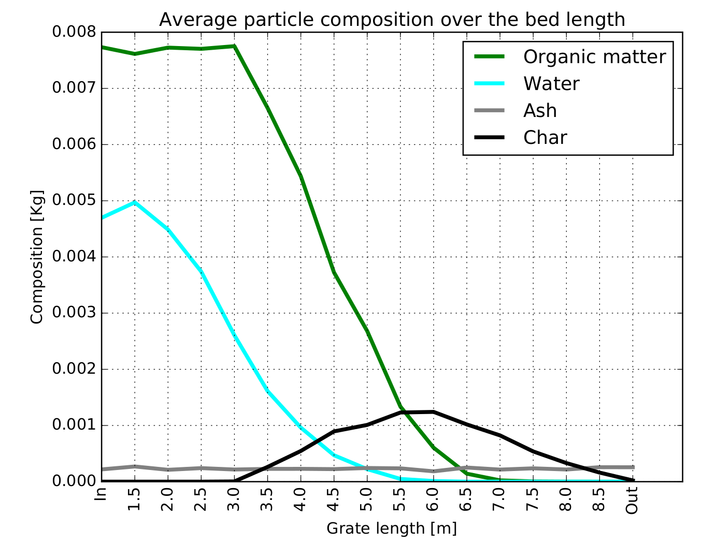

# Digital Twin of  a Biomass Furnace

  <strong>Prof. Bernhard Peters, Dr. Xavier Besseron</strong> 
 
 *XDEM Research Centre
  University of Luxembourg*

 <i class="fa fa-at"></i> <bernhard.peters@uni.lu>,
 <i class="fab fa-internet-explorer"></i> <a href="url">www.xdem.de </a>
 
 

## Summary

Biomass as a renewable energy source continues to grow in popularity to reduce fossil fuel consumption for environmental and economic benefits. Biomass as a solid fuel with considerable amount of moisture and non-homogeneous properties, is difficult to be used in many applications. Combustion and gasification of biomass is the most promising road to follow, however, the processes are complex because of the involved physical and chemical processes on various time and length scales including heating up, drying, pyrolysis, oxidation of gaseous pyrolysis products, char formation and gasification. Therefore, a Digital Twin allows a shift from current empirical-based practice to an advanced multi-physics simulation technology including multi-physical models on different length-scales to mirror accurately the state of furnace which is not feasible through experimental measurements due to the inaccessibility of the packed bed of biomass and the hostile environment. Thus, this process is regarded to be the first step in a chain for innovative and functional design and determines significantly the quality of the furnace and its behaviour.
The Extended Discrete Element Method (XDEM) developed at the University of Luxembourg by Peters et al. [1][2] is an advanced numerical simulation technology for generating a digital twin with desired up-scaling capabilities. For this purpose, XDEM considers the solid material in the above-mentioned applications as a particulate phase i.e. consisting of individual particles. Each particle is a distinctive entity for which both dynamic (position and orientation in space) and thermodynamic (temperature and reaction progress) state is predicted as depicted in fig. 1. Thus, resolving the state of individual biomass particles e.g. wood pellets allows an unprecedented insight into the underlying physics and improves the solution accuracy significantly. Obviously, this approach including millions of particles for industry sized dimensions require large scale simulations on a HPC platform and handling efficiently a large data volume both for analysis and parallel performance.

 
 

<figure class="figure" style ="text-align: center">
    
    <figcaption> <em>Figure 1. Distribution of gas phase temperature and particle surface temperature in a biomass furnace with a thermal capacity of 16 MW. </em> </figcaption>
</figure>

 
 

## The Problem

In order to describe thermal conversion of biomass under a variety of requirements such as emission limits, XDEM [^1][^2] considers the solid material of biomass as a particulate phase i.e. consisting of individual particles. Each particle is a distinctive entity for which both dynamic (position and orientation in space) and thermodynamic (temperature and reaction progress) state is predicted. All particles moving on a forward/backward acting grate form an arrangement with gaseous void space between the particles. Gas as a reactive phase streams through the void space and exchanges heat, mass e.g. species and momentum with individual particles. Summing up all the particle processes results in the global reactor behaviour for which a detailed description over a wide range of scales from inter-particle pore space to integral flow regimes is available. Thus, XDEM describes both particulate and gas phase with the following features:

  *  describing the motion of the particulate material,
  *  resolving the thermodynamic state of each particle and thus describing the spatial reaction process in a particle versus time,
  * resolution of the thermodynamic state in particular its multi-species chemical reaction mechanism of the gas phase for the entire furnace predicting velocity, temperature, composition and chemical reaction between species,
  * a strong coupling between the particulate and gas phase through heat, mass and force exchange.

<video class="embed-responsive embed-responsive-16by9" loop
controls muted>
<source src="videos/2DbiomassCombustion.mp4"
type="video/mp4" />

</video>

The above-mentioned features emphasise already the computational complexity and workload for a biomass furnace. In particular the size of the furnace that require a priori a large CFD mesh with millions of cells alone demand HPC resources for a multi-phase reacting flow. Additionally, the large number of particles coupled strongly to the gas phase add computational load so that biomass furnaces in their various designs can only be handled on HPC platforms. For this purpose, XDEM applies a modular approach meaning that 3 software modules for particle motion, particle thermodynamics and computational fluid dynamics are coupled to predict the behaviour of a biomass furnace. Rather than developing an "all-in-one" multi-physics software platform i.e. single code, a coupling of "best-of-the-class" single-physics software modules in a multi-physics coupling framework for engineering applications is the future road to be followed.
In order to have this platform of coupled modules working efficiently in an HPC environment, XDEM employs a hybrid parallelisation strategy consisting of OpenMP and MPI with a dynamic load balancing. Although this approach allows a deployment on HPC platforms it will not lead to an efficient performance due to an immense communication overhead. Therefore, the XDEM research team at the University of Luxembourg has developed the co-located partitioning technology that significantly reduces the communication overhead [^3][^4]. Classical approaches allow an independent partitioning of each module that results in a large data exchange between the partitions. For a co-located partitioning, the data of each module is assigned to the same partition so that the data for communication is reduced significantly. This technology is a key factor for enabling a highly performant application on a super computer that otherwise would be impossible.

## Results

The coupled approach of resolving base the gas and particulate phases provides a deep insight in to the underlying physics. A thorough analysis of predicted results unveils the physics involved and is vital for design and improved performance. Consequently, the history of each biomass particles as it moves and undergoes chemical reactions is tracked so that the entire conversion history is ready available and exemplified in the following figures 2 and 3 that show the drying process of a wooden pellet versus particle size and time [^5][^6].

 

<figure class="figure">
    
    <figcaption> <em> Figure 2. Residual water mass fraction versus time and particle size during the drying process of an individual wood pellet taking place in a biomass furnace. </em> </figcaption>
</figure>

 

 

<figure class="figure">
    
    <figcaption> <em> Figure 3. Temperature distribution versus time and pellet size corresponding to the water mass distribution in fig. 2 for an individual wood pellet in a biomass furnace. </em> </figcaption>
</figure>

 

After an initial heat-up period, the evaporation temperature is reached upon which evaporation commences at constant temperature represented by the plateau-like formation in fig. 3. Once, all the humidity is removed from a particle section, the temperature is allowed to rise again and providing heat to the inner sections of a particle for evaporation. This behaviour cumulates into a drying front propagating from the outside into the particle’s interior regions as depicted in fig. 2. The vapour formed during the dry process of all particles in a furnace is transferred into the freeboard above the moving bed and transported with the flue gas as shown in fig. 4. In addition, fig. 4 depicts the varying pyrolysis progress of the wooden packed bed represented by the char formation as a main product [^7]. Char is formed while wooden pellets are transported over the grate and is then gasified with primary air to form carbon monoxide. The latter is transferred into the freeboard above the bed and undergoes further oxidation through an extended reaction mechanism and thus highlights the complexity of the entire furnace physics that are accessible only through high performance computing [^8][^9].

 

<figure class="figure">
    
    <figcaption> <em> Figure 4. Distribution of vapour in the furnace plenum and progress of the complex decomposition of the wooden fuel during pyrolysis of the biomass exemplified by the char material formed  of the wooden packed bed </em> </figcaption>
</figure>

 

Obtaining these detailed results allows for a further analysis of the integral behaviour expressed through the species distribution versus the grate length as shown in fig. 5. This distribution is an essential information for the design engineer as it determines the entire grate length required for a complete combustion of wood pellets and thus, has a strong impact on the entire furnace size.

An additional and much broader impact is is generated by strengthening the links between public and private sectors through private-public-partnerships is one of the cornerstones of Luxembourg’s path towards Smart Specialisation and as laid out by the OECD report. It aims at intensifying research, technological development and innovation (RDI) activates by concentrating on Key Enabling Technologies (KETs) such as sustainability. The proposed digital twin concept has a significant impact on on processing of biomass and is considered as a crucial step along the processing chain to the desired high quality biomass furnace encompassing functionality and durability. Creating a digital twin helps to unveil the underlying physics of biomass conversion, and thus, gaining a deepened understanding. The latter enables engineers to design improved reactors and operate them at more favourable conditions with a higher output at reduced costs contributing to a resource efficient Europe. The Digital Twin can also predict responses of the biomass furnace to safety critical events and uncover previously unknown issues before they become critical and thus targets also the societal aspect of safe and reliable processes.

 

<figure class="figure">
    
    <figcaption> <em>Figure 5. Time and space averaged distribution of organic matter, humidity,char and ash as inert material versus grate length. </em> </figcaption>
</figure>

 

## References

[^1] Peters, B., Baniasadi, M., Baniasadi, M., Besseron, X., Estupinan Donoso, A. A., Mohseni, S., & Pozzetti, G. (2019). The XDEM Multi-physics and Multi-scale Simulation Technology: Review on DEM-CFD Coupling, Methodology and Engineering
Applications. Particuology, 44, 176 - 193. http://hdl.handle.net/10993/36884

[^2] B. Peters. The extended discrete element method (XDEM) for multi-physics applications. Scholarly Journal of Engineering Research, 2(1):1-20, 2013

[^3] Pozzetti, G., Jasak, H., Besseron, X., Rousset, A., & Peters, B. (2019). A parallel dual-grid multiscale approach to CFD-DEM couplings. Journal of Computational Physics, 378, 708-722. http://hdl.handle.net/10993/36347

[^4] Pozzetti, G., Besseron, X., Rousset, A., & Peters, B. (2018, September 14). A co-located partitions strategy for parallel CFD-DEM couplings. Advanced Powder Technology. http://hdl.handle.net/10993/36133

[^5] B. Peters, X. Besseron, A. A. Estupinan Donoso, F. Hoffmann, M. Michael, and A. H. Mahmoudi. The extended discrete element method (xdem) applied to drying of a packed bed. Industrial Combustion, 14:1–16, 2014.

[^6] A. H. Mahmoudi, F. Hoffmann, and B. Peters. Application of xdem as a novel approach to predict drying of a packed bed. International Journal of Thermal Sciences, 75:65e75, 2014.

[^7] A. H. Mahmoudi, F. Hoffmann, and B. Peters. Detailed numerical modelling of pyrolysis in a heterogeneous packed bed using xdem. Journal of Analytical and Applied Pyrolysis, 106:9–20, 2014.

[^8] Amir Houshang Mahmoudi, Florian Hoffmann, Miladin Markovic, Bernhard Peters, and Gerrit Brem. Numerical modeling of self-heating and self-ignition in a packed-bed of biomass using xdem. Combustion and Flame, 163:358–369, 2016.

[^9] A. H. Mahmoudi, X. Besseron, F. Hoffmann, M. Markovic, and B. Peters. Modeling of the biomass combustion on a forward acting grate using xdem. Chemical Engineering Science, 142:32–41, 2016.
