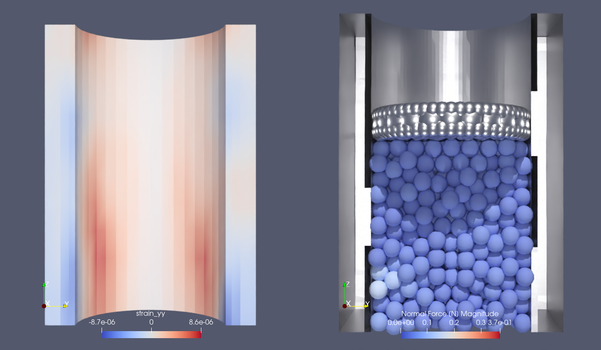
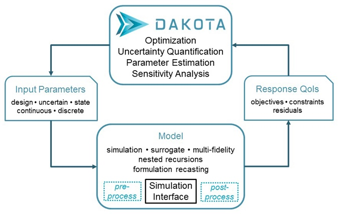
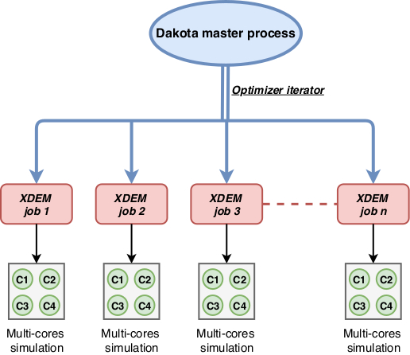

# Parameter Calibration for Multi-Physics Simulations

   **Prof. Bernhard Peters, Dr. Xavier Besseron, Dr. Alban Rousset, Dr. Gabriele Pozzetti (Ceratizit S.A)**  
 
 *LuXDEM Research Centre & Ceratizit S.A,
  Department of Engineering, 
  University of Luxembourg*

   
 <i class="fa fa-at"></i><bernhard.peters@uni.lu>, <xavier.besseron@uni.lu>
 <i class="fab fa-internet-explorer"></i><a href="url">http://luxdem.uni.lu/ </a>
 
 

## Summary

During a collaboration between the University of Luxembourg and the Luxembourgish company Ceratizit, as part of the BRIDGES project VP4HPC, a smart virtual prototyping of a hydraulic powder press has been designed. 
In this context, Smart Virtual Prototyping removes the constraint of physical prototypes and allows to isolate and observe the effect of individual parameters while all others are kept constant. For example, it highlights phenomena that were hidden before, and that can now be observed in the virtual configuration. In the end, this approach reduces the cost of product design and the time-to-market. This shift from a current empirical-based practice to a virtual design is possible using an advanced multi-physics simulation technology. However, sometimes a calibration process is needed when one or several parameters are unknown, and in our case, thousands of simulations to obtain a reasonable estimation of the parameter values. To overcome this computing barrier, we used the Dakota optimization framework to run our model calibration in parallel using the HPC platform of the University of Luxembourg. Thanks to the calibration on the smart virtual prototyping, the partner is now able to run simulations that can take into account the unconventional behaviour of its material during compression. In addition, the HPC platform reduces drastically the time for the model calibration by a factor of 10, from 3000 hours to only 300 hours of simulations.

 
 
<figure class="figure" style ="text-align: center">
    
    <figcaption> <em>Figure 1. Hydraulic powder press coupled simulation FEM [^5] + XDEM [^1][^2]. On the left side FEM simulation of the Hydraulic press and on the right side XDEM simulation with particles. Thanks to parallelization and execution on the Uni.lu HPC platform, calibration study for mechanical powder properties can be simulated. </em> </figcaption>
</figure>     
 
 

## The Problem

Smart Virtual Prototyping allows avoiding a constraint on physical prototypes namely to isolate and observe the effect of an individual parameter while all others being constant. Thus, a large number of hypotheses on causal relationships may be evaluated individually that simply do not exist with physical prototyping. Thereby, phenomena that were hidden before can now be observed. Results obtained to expand the knowledge base and unveil new relations between components of an application. 
Only an extended knowledge of processes allows improved designs and operation which promotes a shift from current empirical-based practice to advanced multi-physics simulation technology. Such practices reduce time-to-market. 
In model calibration a least a thousand executions are necessary to explore and get close to the right parameter value. This means a lot of computing time without using parallelisation. For instance, it takes about 2 hours to run the hydraulic powder press simulation only with openMP  (24 threads) over one node and 2000 executions have to be executed to get the calibration results meaning  about 4000 hours. 
In our approach, we took advantage of the Dakota optimization framework [^3], which supports different levels of parallelisation, to leverage the computing capacity of the HPC cluster of the University of Luxembourg. In our case, Dakota software has been run in sequential with a master process. The latter managed the coarse-grained parallelism by starting multiple jobs concurrently using asynchronous job launching techniques. Each of every job launched by Dakota software's master runs in parallel taking advantage of the fine-grained parallelism of the function evaluation. The data are then collected in a blocking synchronisation manner, in which all jobs in the queue are completed before exiting the scheduler and returning the set of results to the algorithm. The job queue fills and then empties, which provides a synchronisation point for the algorithm.
To disturb the other users of the HPC platform as little as possible, we configured the Dakota software to run the concurrent jobs using the best-effort QOS. In this way, we rely solely on the available resources which are not used by the other users. When a Dakota software evaluation job is running on a resource requested afterward by another user, the concerned resource is freed for the user and the evaluation is re-queued.

 
<figure class="figure">
    
    <figcaption> <em>Figure 2. The loosely-coupled or “black-box” interface between Dakota software and a user-supplied simulation code (<a href="url">https://dakota.sandia.gov</a>). </em> </figcaption>
</figure>
 

## Results

The parallel execution of the calibration for the hydraulic powder press allows a speed up of almost 16 times. Initially, an execution of the hydraulic powder press requires about 2 hours with 24 threads on a single computing node. Thanks to the concurrent execution using Dakota software, the time is reduced from  about 4000 hours to 275 hours.
The speedup can be reduced again if more nodes are available on the cluster. For instance if 2000 nodes were available then the calibration will only take  about 2 hours instead of 4000 hours.

 

<figure class="figure">
    
    <figcaption> <em>Figure 3. The multi-level parallelism and scheduling scheme for the calibration study using Dakota and XDEM. </em> </figcaption>
</figure>
 

**This work is founded by the FNR (Fonds National de la Recherche) and the Luxembourgish company Ceratizit S.A through a BRIDGES project called VP4HPC. Grant 2018-2/13318107-VP4HPC*

## References

[^1]: Peters, B., Baniasadi, M., Baniasadi, M., Besseron, X., Estupinan Donoso, A. A., Mohseni, S., & Pozzetti, G. (2019). The XDEM Multi-physics and Multi-scale Simulation Technology: Review on DEM-CFD Coupling, Methodology and Engineering Applications. Particuology, 44, 176 - 193. http://hdl.handle.net/10993/36884

[^2]: Mainassara Chekaraou, A. W., Rousset, A., Besseron, X., Varrette, S., & Peters, B. (2018). Hybrid MPI+OpenMP Implementation of eXtended Discrete Element Method. Proc. of the 9th Workshop on Applications for Multi-Core Architectures (WAMCA'18), part of 30th Intl. Symp. on Computer Architecture and High Performance Computing (SBAC-PAD 2018). Lyon, France: IEEE Computer Society. http://hdl.handle.net/10993/36374

[^3]: Adams, B. M., Bohnhoff, W. J., Dalbey, K. R., Eddy, J. P., Eldred, M. S., Gay, D. M., ... & Swiler, L. P. (2009). DAKOTA, a multilevel parallel object-oriented framework for design optimization, parameter estimation, uncertainty quantification, and sensitivity analysis: version 5.0 user's manual. Sandia National Laboratories, Tech. Rep. SAND2010-2183.

[^4]: Bungartz, H. J., Lindner, F., Gatzhammer, B., Mehl, M., Scheufele, K., Shukaev, A., & Uekermann, B. (2016). preCICE–a fully parallel library for multi-physics surface coupling. Computers & Fluids, 141, 250-258.

[^5]: Bangerth, W., Hartmann, R., & Kanschat, G. (2007). deal. II—a general-purpose object-oriented finite element library. ACM Transactions on Mathematical Software (TOMS), 33(4), 24-es.

