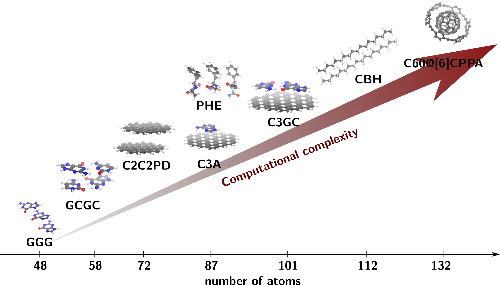
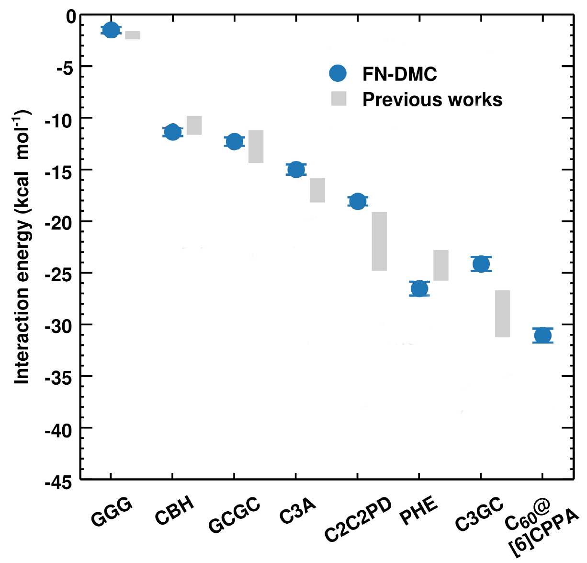

# Toward exact interaction energies in large molecules with Quantum Monte Carlo

   **Alexandre Tkatchenko, Yasmine S. Al-Hamdani, Jorge Alfonso Charry Martinez, Matej Ditte, Matteo Barborini**  
 
 *Theoretical Chemical Physics group,
  Department of Physics and Materials Science, FSTM, 
  University of Luxembourg*

   
 <i class="fa fa-at"></i><alexandre.tkatchenko@uni.lu>
 <i class="fab fa-internet-explorer"></i><a href="url">www.tcpunilu.com </a>
 
 

## Summary

Non-covalent van der Waals (vdW) dispersion interactions play a crucial role for the qualitatively correct and quantitatively accurate description not only of the binding processes, but also of the structural, mechanical, spectroscopic, kinetic and even electronic properties of an extensive set of molecules and materials [^1][^2].
These forces, that are quantum mechanical in origin, arise from the electrostatic interaction between fluctuating electron clouds in molecules and materials, and their influence can even extend over distances of 10s of nanometers, influencing the stability of proteins, of the DNA's double-helix, contributing to the pedal adhesion of geckos over smooth surfaces and even to cohesion in asteroids [^1][^2].

In light of these facts, great effort has been put in finding accurate ways to model these interactions[^3][^4][^5] trying to overcome the prohibitively high computational costs of the high-level wavefunction methods of quantum chemistry [^10]  such as Coupled Cluster (CC)[^11], especially by defining progressively accurate approaches within electronic structure methods based on density functional theory (DFT)[^4].

Yet, despite the successful attempts, the vdW models rely on parameters that are associated with the systems' electronic properties, such as the dipole and quadrupole moments’ polarizabilities of bonded atoms [^3][^5][^6]. Here, still much has to be understood and high-level calculations with accurate quantum chemistry methods are necessary to provide parameters and to be used as references  [^7][^8].

In order to improve vdW models, reference calculations must be extended to large supramolecular complexes with an increase of the computational cost. In order to do so HPC facilities are an essential tool and their usage will be described in the following section. In ref. [^5] the IRIS HPC of the university of Luxembourg has been used to compute the interaction energies of molecular complexes from the L7 data set [^12] with surprisingly accurate results via Monte Carlo methods (see Figure 1).

 
 
<figure class="figure" style ="text-align: center">
    
    <figcaption> <em>Figure 1.  The supramolecular complexes from L7 data set [^12] and the buckyball-ring supramolecular have number of atoms ranging from 48 to 132 are used to benchmark state-of-the-art methods for non-covalent interactions. (Adapted from ref. [^8]) </em> </figcaption>
</figure>     
 
 

## The Problem

The challenge of modeling interactions in large chemical compounds requires the extensive use of High Performance computing facilities with large parallel jobs, important dynamical memory allocations and high-bandwidth communication structures between nodes. 

For this reason in our group we use quantum Monte Carlo (QMC) methods[^10], which are stochastic techniques used to solve multidimentional integrals, associated to the values of physical observable (energy, dipole, quadrupole and others) over chosen parametrized trial wave functions, that are optimized through energy minimization algorithms. 
In general, the advantage of QMC with respect to other accurate quantum Chemistry methods such as for example Coupled Cluster (CC) [^11] lies in two factors.

First, QMC algorithms are intrinsically parallel, since the analytic integrals are computed through a stochastic sampling of the configuration space that is performed through independent parallel random walks.
This enables us to integrate systems with thousands of dimensions (associated to the coordinates of the particles in our chemical systems) scaling on thousands of cores, with low communication between nodes and reduced random-access memory allocation [^5]. 

Second, the stochastic nature of the integration enables us to work with complicated parametrized trial wave functions, that explicitly depend on the relative distances between the systems' particles, thus bettering the description of the correlation effects, crucial for the correct modeling of vdW interactions.
Thus, the computational complexity of our calculations depends on two main factors: the number of particles in the system, which is associated to the number of dimensions to integrate, and the number of parameters in the trial wave function, that is associated with the accuracy of our model. 

Regarding the number of particles in the system, the QMC algorithms have an advantage with respect to other accurate quantum Chemistry methods, since the computational cost scales as the third-fourth power (depending on the algorithm) of the number of particles. 

Accurate quantum chemical methods such as CC, on the other hand, scale as the fifth-seventh power of the number of particles, depending on the accuracy required.

Regarding the parametrization of the trial wave function, QMC is able to overcome the limitations of traditional quadrature methods to integrate whatsoever complicated wave functions that can not only reduce the number of parameters, but also better the overall description of the physical state granting both a lower computational cost and an increased general accuracy.

A problem of QMC methods is that, due to their statistical nature, the computational cost has a computational prefactor with respect to other quantum Chemistry methods and for this reason the computational optimization of the algorithms is required.

In order to implement more sophisticated solutions based on this method, the group is developing a quantum Monte Carlo code in Fortran 2003 in order to explore possible innovative solutions to model vdW interactions. 
The code will be optimized for heavy usage of CUDA - GPU acceleration in order to reduce the computational prefactor and treat systems up to thousands of atoms.

## Results and Impact

In recent years great effort has been put in the development of efficient, accurate approaches to tackle large atomic systems at various level of theory.
In the framework of quantum Monte Carlo methods it is worth mentioning that the latest improvements [^7][^8][^9] have greatly enhanced the accuracy especially of diffusion Monte Carlo within the Fixed-node approximation (FN-DMC) to describe cohesive energies of systems bound by dispersive forces[^7][^8][^9]. 

In the ref. [^8] for example, it is shown how FN-DMC can accurately describe the interaction energies of the significant supramolecular complexes of the L7 data set that is used to benchmark non-covalent interactions [^12] (see Figure 2).
In this work we have employed highly optimized algorithms for FN-DMC pushing them beyond the typically applied limits. The computational cost of the FN-DMC calculations is around 0.7 million CPU core hours for FN-DMC equivalent to running a modern 28 core machine constantly for nearly 3 years.

Clearly the future progresses of HPC facilities and the integration with CUDA GPU accelerations applied to Monte Carlo algorithms will favor a further reduction of the computational time required and thus open to the possibility of applying QMC methods to larger compounds. This, as a consequence, will lead to a bettering of the vdW models which will be parametrized on progressively more data bettering their overall accuracy and their applicability, and increasing our understanding of non-covalent forces that are so crucial in a large variety of physical, chemical and biological phenomena [^1][^2] .

 
 
<figure class="figure" style ="text-align: center">
    
    <figcaption> <em>Figure 2.  TFN-DMC interaction energies for the supramolecular complexes of the L7 data set [^12] and the C60 @[6]CPPA buckyball-ring complex arranged in terms of increasing interaction strength. Gray bars mark the range of interaction energies reported in the literature using alternative wavefunction based methods. (Adapted from ref. [^8]) </em> </figcaption>
</figure>     
 
 

## References

[^1]: Jan Hermann, Robert A. DiStasio, and Alexandre Tkatchenko First-Principles Models for van der Waals Interactions in Molecules and Materials: Concepts, Theory, and Applications Chem. Rev. 2017 117(6), 4714-4758 DOI:10.1021/acs.chemrev.6b00446

[^2]: Martin Stöhr, Troy Van Voorhisb and Alexandre Tkatchenko Theory and practice of modeling van der Waals interactions in electronic-structure calculations Chem. Soc. Rev., 2019 48, 4118-4154 DOI:10.1039/C9CS00060G

[^3]: Dmitry V. Fedorov, Mainak Sadhukhan, Martin Stöhr, and Alexandre Tkatchenko, Quantum-Mechanical Relation between Atomic Dipole Polarizability and the van der Waals Radius, Phys. Rev. Lett. 2018, 121, 183401 DOI:10.1103/PhysRevLett.121.183401

[^4]: Jan Hermann and Alexandre Tkatchenko Density Functional Model for van der Waals Interactions: Unifying Many-Body Atomic Approaches with Nonlocal Functionals, Phys. Rev. Lett. 2020 124, 146401 DOI:10.1103/PhysRevLett.124.146401

[^5]: Martin Stöhr, Mainak Sadhukhan, Yasmine S. Al-Hamdani, Jan Hermann, Alexandre Tkatchenko, Coulomb Interactions between Dipolar Quantum Fluctuations in van der Waals Bound Molecules and Materials (submitted) DOI:arXiv:2007.12505

[^6]: Andrii Kleshchonok, Alexandre Tkatchenko, Tailoring van der Waals dispersion interactions with external electric charges, Nature Commun. 2018, 9, 3017 DOI:10.1038/s41467-018-05407-x

[^7]: Yasmine S. Al-Hamdani, Alexandre Tkatchenko, Understanding non-covalent interactions in larger molecular complexes from first principles, J. Chem. Phys. 2019, 150, 010901 (2019) DOI:10.1063/1.5075487

[^8]: Yasmine S. Al-Hamdani, Péter R. Nagy, Dennis Barton, Mihály Kállay, Jan Gerit Brandenburg, Alexandre Tkatchenko, Interactions between Large Molecules: Puzzle for Reference Quantum-Mechanical Methods, (submitted) DOI:arXiv:2009.08927

[^9]: Andrea Zen, Jan Gerit Brandenburg, Jiří Klimeš, Alexandre Tkatchenko, Dario Alfè, and Angelos Michaelides, Fast and accurate quantum Monte Carlo for molecular crystals, PNAS 2018 115 (8) 1724-1729 DOI:10.1073/pnas.1715434115

[^10]: W. M. C. Foulkes, L. Mitas, R. J. Needs, and G. Rajagopal Quantum Monte Carlo simulations of solids, Rev. Mod. Phys. 2001 73, 33 DOI:10.1103/RevModPhys.73.33

[^11]: Rodney J. Bartlett and Monika Musiał Coupled-cluster theory in quantum chemistry, Rev. Mod. Phys. 2007 79, 291

[^12]: R. Sedlak, T. Janowski, M. Pitoňák, J. Řezáč, P. Pulay, and P. Hobza, Accuracy of quantum chemical methods for large noncovalent complexes, J. Chem. Theory Comput. 2013 9, 3364 DOI:10.1021/ct400036b
