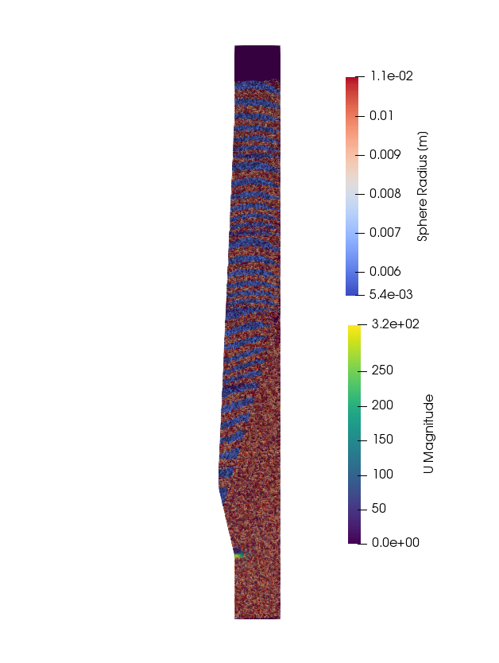
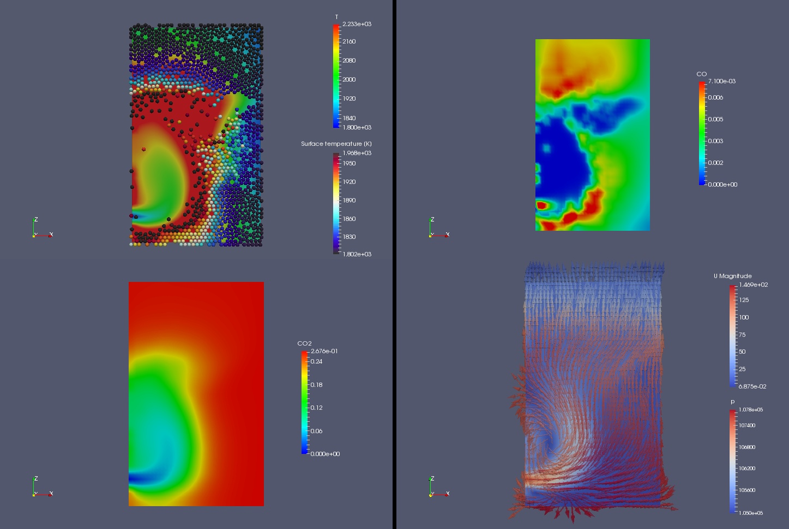
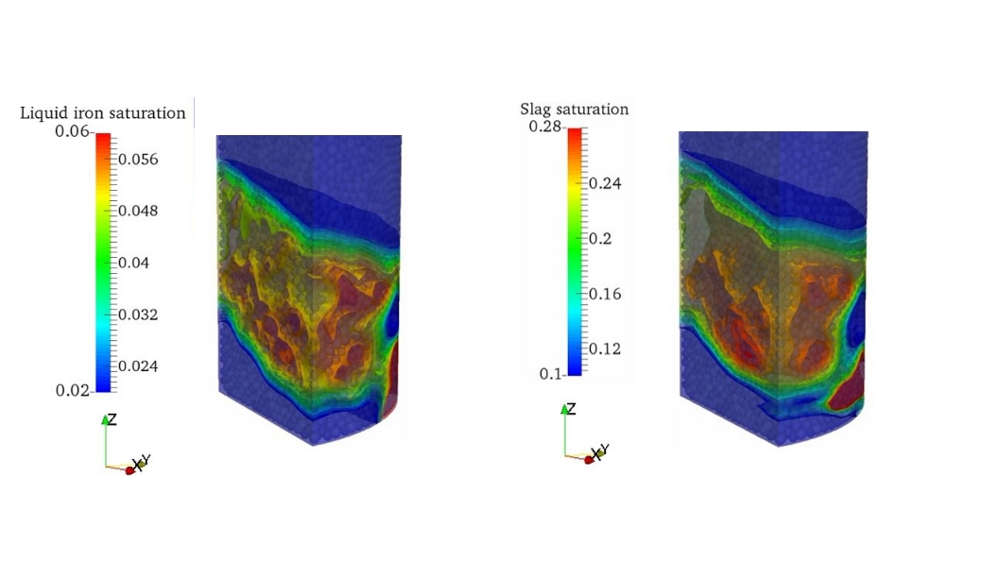

# Transition to Green Hydrogen in Steel Making

   **Prof. Bernhard Peters, Dr. Xavier Besseron **  
 
 *XDEM Research Centre,
  University of Luxembourg*

   
 <i class="fa fa-at"></i><bernhard.peters@uni.lu>, <xavier.besseron@uni.lu>
 <i class="fab fa-internet-explorer"></i><a href="url"> www.xdem.de </a>
 
 

## Summary

Iron and steel have a strong impact on day-to-day life. The versatile properties of iron and steel allows using it in numerous sectors such as construction, energy, transportation and processing industry and has led to an expanding global demand for the production of iron and steel. Traditionally, iron is produced in a blast furnace, most probably the biggest reactor built on earth as depicted in fig. 1.  Coke in blast furnace forms carbon monoxide when burned and acts as a reducing agent. It reacts with the charged iron oxide to produce molten crude (pig) iron and slag. Liquid iron and slag trickle down to the hearth of the blast furnace. Both, the chemical reaction process in conjunction with a complex multi-phase flow of gas, molten iron and slag are a challenging task for control and performance of a blast furnace that is aggravated due to  a largely inaccessible interior. However, traditional production has a significant environmental impact because iron reduction produces large amounts of carbon dioxide and thus, contributes to the green house gas (GHG) emissions. 

New production technologies explore the use of hydrogen as a reducing agent instead of carbon monoxide from coke to reduce the carbon foot print significantly. Rather than emitting carbon dioxide, hydrogen as a reducing gas produces water vapour only. In  particular, when green hydrogen derived from renewable sources is employed, the steel making process is completely emission-free, producing green steel.

During the transition to green hydrogen in steel making, the numerical framework for a blast furnace as shown in fig. 1 of the extended discrete element method (XDEM) [^1][^2] plays a vital role in the analysis of the entire process of a complex reacting multiphase environment. Already attributed to the sheer size of a blast furnace (3000–5000 m3), a large volume of data has to be handled within large scale simulations of the entire blast furnace process. Analysing the results obtained by a highly efficient simulation with XDEM that employs cutting edge technology [^3][^4] in high-performance computing paves the road to improved processes with reduced energy resources.

 
<figure class="figure" style ="text-align: center">
      
    <figcaption> <em>Figure 1. Distribution of gas velocity and particles size in a blast furnace.
 </em> </figcaption>
</figure>     
 

## The Problem

The process in a blast furnace is a complex interaction including heat and mass transfer in a multiphase flow process between various chemically reacting species in a hostile environment that allows only very limited access for measurements. Therefore, accurate simulations with XDEM are considered as a complementary approach to support analysis, design and performance of a blast furnace in general and based on green hydrogen in particular. For this purpose, XDEM replicates solid material appearing as ores or coke as individual particles with their specific shapes and sizes. Each particle is a distinctive entity for which both dynamic (position and orientation in space) and thermodynamic (temperature and reaction progress) state is predicted. All particles moving or fixed in space form an arrangement with void space as gaseous space between the particles. Gas as a reactive phase streams through the void space and exchanges heat, mass e.g. species and momentum with individual particles. Heat and mass transferred to particles initiate both heat-up and a chemical reaction such as reduction of iron ore to a pure metallic phase while momentum transfer determines the trajectory of each particle. Describing accurately all individual particle processes including their interaction results in the global reactor behaviour for which a detailed description over a wide range of scales from inter-particle pore space to integral flow regimes is available. 

In order to allow simulations of large scale application, XDEM employs a hybrid technology for parallel computing. It incudes the parallel features of OpenMP and MPI (message passing interface) that show best performance with a high degree of scalability. However, these efforts have to be supported by a newly developed partition strategy for multi-physics applications [^3][^4] that reduce significantly the communication load between the flowing phases e.g. gas and molten material in a blast furnace and the coke and ore particles. 

<video width="640" height="480" class="embed-responsive embed-responsive-16by9" loop
controls muted>
<source src="videos/raceway.mp4"
type='video/mp4' />

</video>

## Results

The results obtained with XDEM allow an unprecedented insight into the interior process of a blast furnace unveiling the underlying physics. The following snapshots depict key processes in blast furnace technology and highlight the engineering complexity. Starting the raceway, shown in fig. 2, a hot blast gas is injected with a velocity of app. 200 m/s that leads to a violent dynamic interaction with the coke particles. It significantly effects the oxidation of coke particles to form the reducing gas carbon monoxide that is transported into the upper regions of the blast furnace. There, it reduces iron oxide that eventually produces molten iron and slag in the cohesive zone as shown in fig. 2. In addition, distributions of both carbon monoxide and dioxide are shown in conjunction with the gas phase velocity and pressure. 

 
<figure class="figure" style ="text-align: center">
    
    <figcaption> <em>Figure 2. aceway dynamics: Top left: Temperature distribution of gas and coke particles; Top right: Distribution of carbon monoxide due to gasification of coke; Bottom left: Distribution of carbon dioxide due to partial oxidation of carbon monoxide; Bottom right: Distribution of gas velocity and pressure. </em> </figcaption>
</figure>     
 

Carbon monoxide formed is transported into the reduction zone of the blast furnace  so that eventually liquid iron and slag are produced in the cohesive zone as shown in fig.  3. Molten iron and slag trickle down through the void space between the coke particles and gather in the hearth of the furnace. In this region, a complex interaction between gas, liquids and solid particles occurs which contributes to an exchange of large volumetric data and numerous physical processes for a reacting multi-phase flow. It only can be resolved with advanced and innovative parallelisation strategies and load balancing techniques in an HPC environment.

The performance of the parallel execution was evaluated on the charging of a hopper with 1 million particles. For this case, the new version of the code  offers a 32.8 speedup when running on 5 computing nodes on hybrid mode with 2 MPI processes per node and 14 OpenMP threads per process. Those results are highly dependent on the test case being considered, and usually cases with more particles show a better speedup.
With this configuration, the simulation of the settlement of 1 million particles over 10 seconds requires about 380 hours of computation time on 5 nodes, more than 15 days. In sequential, this same simulation is estimated to run for one year and half. 

 
<figure class="figure" style ="text-align: center">
    
    <figcaption> <em>Figure 3. Distribution of molten iron and slag trickling down in the blast furnace.</em> </figcaption>
</figure>     
 

Summarising, the high-performing simulation environment of XDEM allows examining the complex process for steel making by literally simulating the behaviour and interaction of individual particles or grains. There are fascinating and topical science and engineering questions to be investigated that extend to the heart of material processing and helping to find the next generation of new and innovative green hydrogen technology. XDEM provides the potential to address these questions such as better performance at reduced energy consumption. Thus, it increases the scientific reputation of the University of Luxembourg within the European research area and worldwide. It also contributes to attract top-level researchers as PhDs, post-docs and academic visitors and helps to train the next generation of engineers addressing and promoting modelling in a wide range of engineering applications. 
In particular, a numerical simulation platform for material processing will help to pave the road towards innovative process design at increased efficiency and closes a large technological gap for both research and industry. Material processing is an essential step in a chain towards a final product, and is considered as the key process for smart materials with designed functionality. Similarly, a replacement of fossil fuels by renewable sources such as hydrogen are evaluated, even before expensive and time-consuming modifications are carried out at a reactor, and thus contributing to a resource efficient Europe. The technology is then readily transferable to stakeholders in industry, and thus strengthens the link between the private and research sector. In addition it contributes to Luxembourg’s efforts to become more independent from the banking sector and to develop leading key technologies for new materials within the smart specialisation strategy. 

In addition to engineering requirements, societal needs demand virtual prototyping that allows a shift from current empirical-based practice to an advanced multi-physics simulation technology. Often, engineers opt for "copy& paste technology" of already proven components and systems from previous generations. It results in a conservative design with little potential for innovative ideas. These limitations are removed by virtual prototyping that is among "Gartner’s Top 10 Computer Aided Design Strategic Technology Trends for 2017" [^5].

## References

[^1]: Peters, B., Baniasadi, M., Baniasadi, M., Besseron, X., Estupinan Donoso, A. A., Mohseni, S., & Pozzetti, G. (2019). The XDEM Multi-physics and Multi-scale Simulation Technology: Review on DEM-CFD Coupling, Methodology and Engineering Applications. Particuology, 44, 176 - 193. http://hdl.handle.net/10993/36884
[^2]: B. Peters, F. Hoffmann, D. Senk, A. Babich, J. Simoes, and L. Hausemer. Experimental and numerical investigation into iron ore reduction in packed beds. Chemical Engineering Science, 140, 2015
[^3]: Pozzetti, G., Jasak, H., Besseron, X., Rousset, A., & Peters, B. (2019). A parallel dual-grid multiscale approach to CFD-DEM couplings. Journal of Computational Physics, 378, 708-722. http://hdl.handle.net/10993/36347
[^4]: Pozzetti, G., Besseron, X., Rousset, A., & Peters, B. (2018, September 14). A co-located partitions strategy for parallel CFD-DEM couplings. Advanced Powder Technology. http://hdl.handle.net/10993/36133
[^5]: Top 10 Strategic Technology Trends for 2017. https://www.indianweb2.com/2016/11/22/top-10-strategic-technology-trends-2017-gartner/m. Accessed: 2017-07-20.